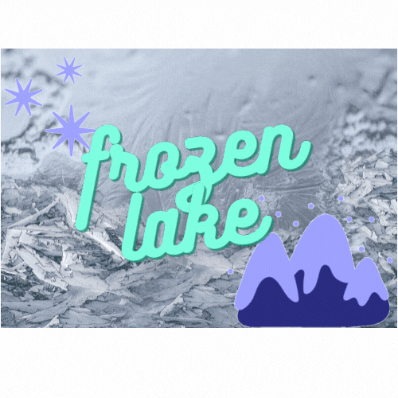

# Frozen Lake Notebook

This notebook includes reinforcement learning algorithms and a epsilon-greedy function.

# Frozen Lake

Frozen Lake is a playground built by OpenAI Gym, available for use in Q-Learning, a Reinforcement Learning method.

Frozen Lake website: https://gym.openai.com/envs/FrozenLake-v0/

Frozen Lake GitHub repo : https://github.com/openai/gym/blob/master/gym/envs/toy_text/frozen_lake.py

## Libraries Used

    gym
    numpy
    random
    time
    
## Author

-   **İrem Akyol**  - [iremakyol](https://github.com/lastirembender)    
    
## References   

- [reinforcement course](https://simoninithomas.github.io/deep-rl-course/#)
